# VOCÊ Salon & Spa — demo de rediseño web

> ⚠️ **Demo conceptual no oficial.** Propuesta de sitio web preparada por **INKRAAD** como presentación comercial para VOCÊ Salon & Spa. No está publicada, afiliada ni aprobada por el salón. Los datos marcados como *ejemplo* no son reales (detalle abajo).

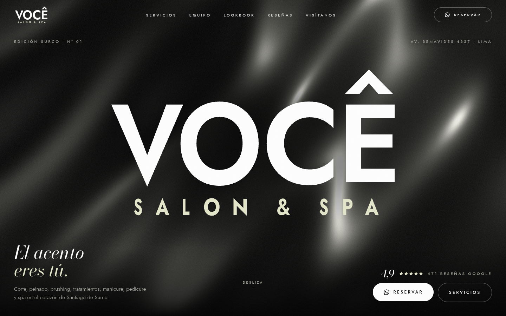

## La marca

| | |
|---|---|
| **Nombre** | VOCÊ Salon & Spa (en Google: “VOCE salon&spa Surco”) |
| **Rubro** | Salón de belleza y spa: corte, peinado, cambio de look, reacondicionado / tratamientos capilares, lavado y brushing, manicure, pedicure y spa |
| **Distrito** | Santiago de Surco, Lima — Av. Alfredo Benavides 4827, Urb. Las Gardenias Etapa 1 |
| **Reputación** | **4,9 ★ con 471 reseñas** en Google Maps (fuente: espejo de datos de Google, oct-2026; confirmar en vivo antes del pitch) |
| **Presencia actual** | **Sin sitio web.** Instagram [@vocesalonspa](https://www.instagram.com/vocesalonspa/) con 13K seguidores y 1.026 publicaciones. Sin Facebook verificado. |
| **Identidad** | Logo tipográfico monocromo: “VOCÊ” en sans geométrica blanca con circunflejo y “SALON & SPA” espaciado, sobre negro. |

## Qué se construyó

### Concepto creativo — “El acento eres tú”
*Você* significa “tú” en portugués, y el rasgo más distintivo del logo es el **circunflejo** de la Ê. La web convierte ese acento en la firma de toda la experiencia: el acento *aterriza* sobre la E en el loader, se posa sobre lo que señalas con el cursor, marca cada sección y cierra la página. El fondo es una **seda negra líquida en 3D** —como un cabello recién peinado o un satén de alta costura— y la maqueta es la de una **revista de moda monocroma** (“Edición Surco · Nº 01”), con tipografía cinética y un movimiento lento y lujoso. El cierre cambia a **seda marfil**, el único acento de color, sacado del propio logo.

### Secciones
1. **Loader de marca** — las letras de VOCÊ se trazan, el circunflejo cae sobre la E y el telón se abre.
2. **Hero / portada** — seda líquida 3D (shader) que reacciona al puntero, el logo oficial gigante como cabecera de revista, eslogan “El acento eres tú.”, calificación 4,9 ★ y botón de reserva.
3. **Manifiesto** — texto que se revela palabra a palabra con el scroll + tres valores sacados de reseñas reales.
4. **Cinta de servicios** — marquee tipográfico infinito que se inclina según la velocidad del scroll.
5. **El menú (servicios)** — índice editorial en acordeón accesible; en escritorio una imagen flotante sigue al cursor. Botón “Consultar por WhatsApp” con mensaje prellenado por servicio.
6. **Promos** — “Cada día, un descuento”, con el día de hoy (hora de Lima) resaltado. *Promos de ejemplo.*
7. **Equipo** — Hugo, Karin, Athenas y Viviana (nombres citados en reseñas), con retrato tipográfico y la cita real de su reseña.
8. **Lookbook** — galería con scroll horizontal fijado (pin) y parallax interno; carrusel táctil en móvil; cierre hacia Instagram.
9. **Reseñas de Google** — contador animado hasta 4,9, estrellas y carrusel de reseñas reales.
10. **La casa** — sobre el salón y cifras públicas (4,9★, 471 reseñas, 13K seguidores, 1.026 publicaciones).
11. **Visítanos** — mapa interactivo de Google (carga diferida), horario con estado “Abierto/Cerrado ahora” en hora de Lima, horas punta reales, “Cómo llegar” y llamada.
12. **Reserva** — seda marfil 3D y CTA a WhatsApp / Instagram / teléfono.
13. **Footer** — wordmark gigante, datos, navegación, aviso de demo y créditos de imágenes. En móvil, barra fija de reserva.

### Efectos e interacciones
- **Three.js / React Three Fiber**: plano de tela de 43 000 vértices plegado en el *vertex shader* (ondas con *domain warping*), *fragment shader* de satén (brillo ancho + brillo nítido + fresnel + viñeta + grano). Onda al pasar el puntero; los pliegues se intensifican con el scroll. Dos variantes: negra (hero) y marfil (cierre). `PerformanceMonitor` de drei baja la resolución si cae el rendimiento; el render se pausa fuera de pantalla.
- **GSAP + ScrollTrigger + SplitText**: entrada cinética del logo letra a letra, salida del hero (las letras se abren como tela), titulares revelados por líneas con máscara, manifiesto palabra a palabra, *clip-path reveals*, parallax de imágenes, lookbook horizontal con `containerAnimation`, contador de reseñas.
- **Lenis**: scroll suave sincronizado con el ticker de GSAP; navegación por anclas con foco accesible.
- **Motion**: menú móvil a pantalla completa, acordeón de servicios, transición con desenfoque entre reseñas.
- **Cursor de marca** (punto + anillo con `mix-blend-difference`, etiquetas contextuales y el circunflejo que “cae” sobre los enlaces), **botones magnéticos**, grano de película animado.

### Accesibilidad, rendimiento y SEO
- `prefers-reduced-motion`: sin loader largo, sin Lenis ni animaciones de scroll; la seda se renderiza como un fotograma estático.
- Móvil: geometría 3D más ligera (110×90 segmentos) y DPR limitado, sin cursor, lookbook táctil con *scroll-snap*; si no hay WebGL se usa un degradado.
- Contraste AA verificado con axe-core (0 infracciones WCAG 2 A/AA), enlace “Saltar al contenido”, foco visible marfil, `alt` descriptivos, acordeones con `aria-expanded`, reseñas con `aria-live`, menú móvil con `Escape`.
- SEO: `lang="es-PE"`, título y descripción, Open Graph + Twitter Card con imagen 1200×630 (`public/og-image.jpg`), **schema.org `BeautySalon`** (dirección, geo, horario, `aggregateRating`, catálogo de servicios, Instagram). Lleva `noindex` por ser una demo.
- El chunk 3D (~240 kB gzip) se carga de forma diferida; la página principal pesa ~186 kB gzip de JS.

### Identidad aplicada
- **Logo**: el original es la foto de perfil de Instagram (100×100 px). Se **reconstruyó en SVG** midiendo el original píxel a píxel (Jost SemiBold ajustada letra por letra + circunflejo dibujado a mano); diferencia media < 2 % por píxel. El original se conserva junto al vector. Ver `docs/marca/` y `scripts/build-logo.mjs`.

  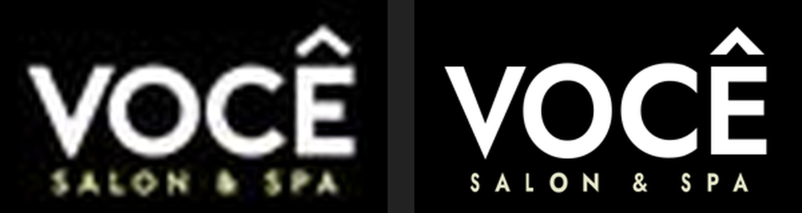
- **Paleta**: negro `#000000` y blanco `#FFFFFF` del logo. **Acento marfil `#E4E6C9`**: es el tono real de “SALON & SPA” en el logo original (muestreado ≈ rgb 228,231,200), así que no se inventa un color nuevo; se usa en menos del 5 % de la superficie. Gris cálido `#6A6A61` del logo para detalles.
- **Tipografías** (OFL): **Jost** (geométrica tipo Futura, la más cercana al logo) y **Bodoni Moda** itálica para el contrapunto editorial.
- Manual completo: [`docs/marca/manual-de-marca.md`](docs/marca/manual-de-marca.md).

## Tecnologías
Vite 8 · React 19 · TypeScript 6 · Tailwind CSS v4 · Three.js 0.182 · @react-three/fiber 9 · @react-three/drei 10 · GSAP 3.15 (ScrollTrigger, SplitText) · Lenis · Motion · Fontsource (Jost, Bodoni Moda) · Playwright (capturas) · sharp + opentype.js (scripts de imágenes y logo).

## Cómo correrlo
```bash
npm install
npm run dev        # http://localhost:3121
npm run build      # build estático en dist/
npm run preview    # sirve dist/ en http://localhost:3121

# opcionales
npm run logo       # regenera el wordmark SVG desde las medidas del logo
npm run images     # vuelve a descargar y procesar las fotos de Unsplash
npm run preview & npm run shots   # capturas con Chrome headless (requiere /usr/bin/google-chrome)
```

## Datos reales vs. contenido de ejemplo
**Reales** (fuentes públicas, investigación del 06-oct-2026): nombre, logo, dirección y coordenadas, teléfono +51 923 461 397, horario (lun–sáb 8:30–20:00, dom cerrado), horas punta (mié 17–18 h, sáb 14–15 h), calificación 4,9★ y 471 reseñas, las tres reseñas citadas, nombres del equipo (Hugo, Karin, Athenas, Viviana), lista de servicios, “descuentos cada día”, Instagram (13K seguidores, 1.026 publicaciones).

**De ejemplo / propuesta (no reales):**
- **Promos por día** (Brushing, Manicure, Tratamiento…): inventadas para mostrar el formato; la web las rotula como “Ejemplo”.
- **Precios**: no se publican (VOCÊ no los muestra); se indica “a consultar”.
- **Descripciones de servicios** y textos (“El acento eres tú”, manifiesto, “Edición Surco · Nº 01”): redacción propuesta.
- **Especialidades del equipo**: inferidas de las reseñas; la de Viviana está “por confirmar”. **Sin fotos reales del equipo** (retrato tipográfico, “Foto por confirmar”).
- **Fotografías**: imágenes referenciales de Unsplash, no del salón.
- **WhatsApp**: se usa el teléfono público de Google; falta confirmar que sea WhatsApp.
- **Detalle de los servicios de spa**: no publicado.
- El color marfil como acento oficial y el SVG del logo deben validarse con VOCÊ (pedir el vectorial original).

## Créditos de imágenes
Todas bajo la [Licencia Unsplash](https://unsplash.com/license), descargadas al repo y convertidas a monocromo (`public/img/`).

| Uso | Foto | Autor |
|---|---|---|
| Corte | [8CLerODobnc](https://unsplash.com/photos/8CLerODobnc) | Gabriela (@gabigi) |
| Peinado | [i7vBQJCeJso](https://unsplash.com/photos/i7vBQJCeJso) | Alexander Krivitskiy (@krivitskiy) |
| Lavado & brushing / Lookbook “Brillo” | [npl2BAJDZOU](https://unsplash.com/photos/npl2BAJDZOU) | Alexander Krivitskiy (@krivitskiy) |
| Tratamientos / Lookbook “Ondas” | [WC4oVkiyfmQ](https://unsplash.com/photos/WC4oVkiyfmQ) | Alef Morais (@alef_visuals) |
| Manicure | [2Eh-J7X5Qdw](https://unsplash.com/photos/2Eh-J7X5Qdw) | Kellen Barnes (@boysenberriefairie) |
| Pedicure | [aBUCQtLcMDQ](https://unsplash.com/photos/aBUCQtLcMDQ) | Konstantin Shmatov (@shmatov) |
| Spa | [uWiQaLrQDMM](https://unsplash.com/photos/uWiQaLrQDMM) | Jakub Klucký (@jakubklucky) |
| Lookbook “Pausa” | [vJkYYMFK6s4](https://unsplash.com/photos/vJkYYMFK6s4) | Klara Kulikova (@kkalerry) |
| Lookbook “Mirada” | [dGDtoqYv1KQ](https://unsplash.com/photos/dGDtoqYv1KQ) | Beyza Yurtkuran (@beyzaayurtkuran) |
| Lookbook “Melena” | [d0L8WpvTBCc](https://unsplash.com/photos/d0L8WpvTBCc) | Marco Guerrero (@marcoguerreroleon) |
| Lookbook “Manos” | [Kv3fj21tngM](https://unsplash.com/photos/Kv3fj21tngM) | Severina Seidl (@myworldisblue) |
| La casa (espejos) | [9Snkrx_UU6A](https://unsplash.com/photos/9Snkrx_UU6A) | Sean Boyd (@seanfboyd) |
| La casa (tocador) | [u-jq0g_ZdZE](https://unsplash.com/photos/u-jq0g_ZdZE) | Giorgio Trovato (@giorgiotrovato) |

Fuentes: Jost y Bodoni Moda (SIL Open Font License) vía Fontsource.

## Capturas
| Escritorio (1440×900) | Móvil (390×844) |
|---|---|
|  | 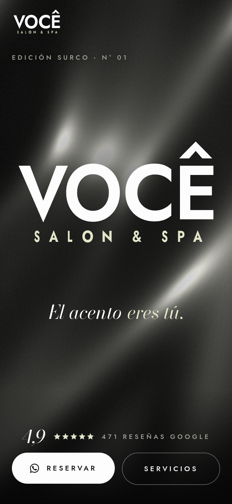 |
| 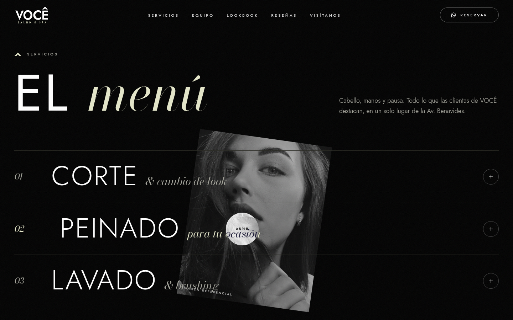 | 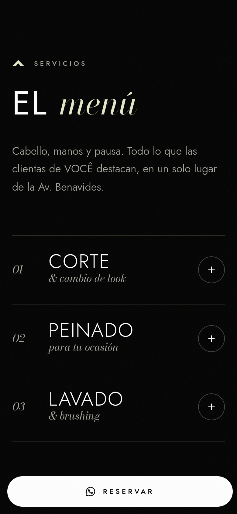 |
| 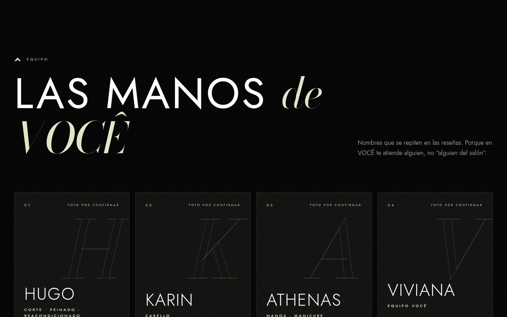 | 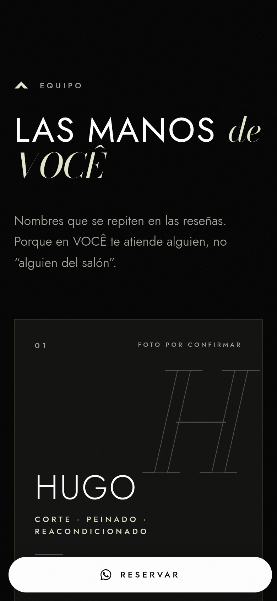 |
| 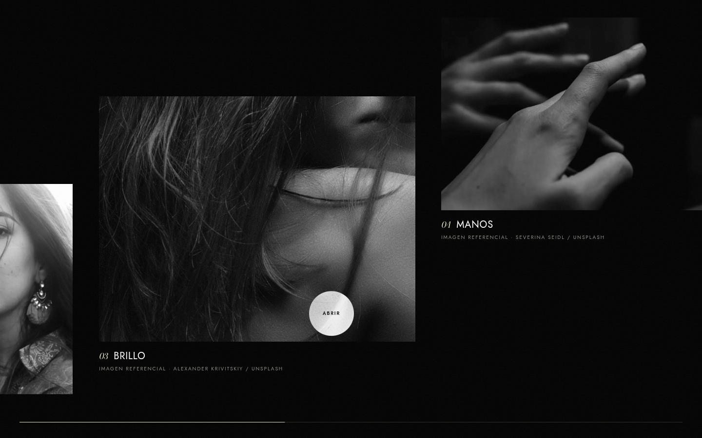 | 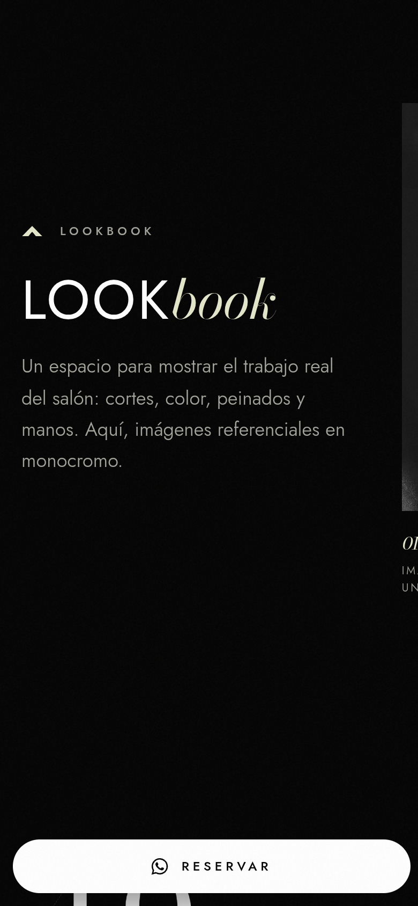 |
| 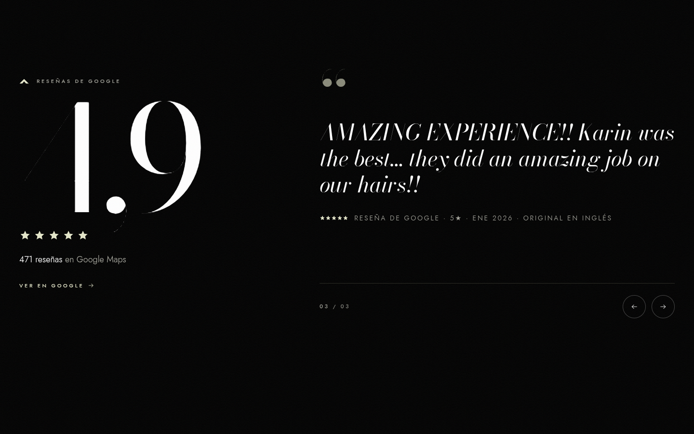 | 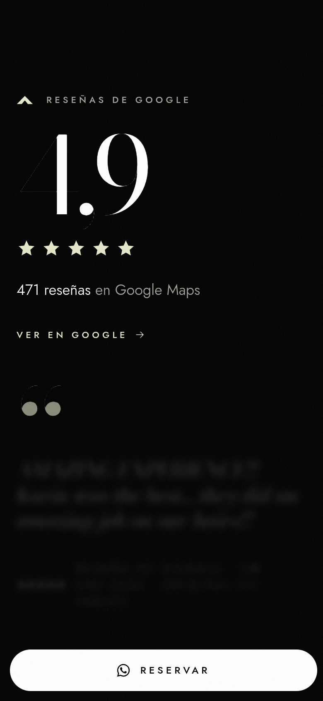 |
| 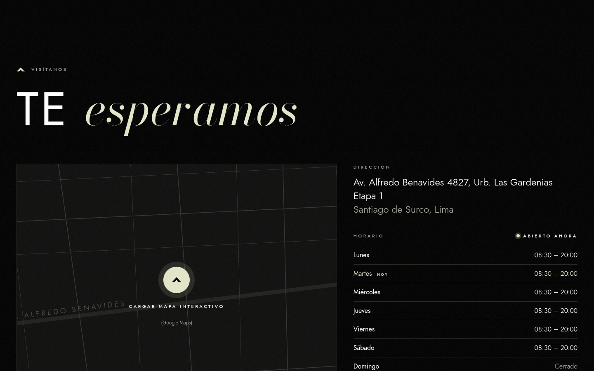 | 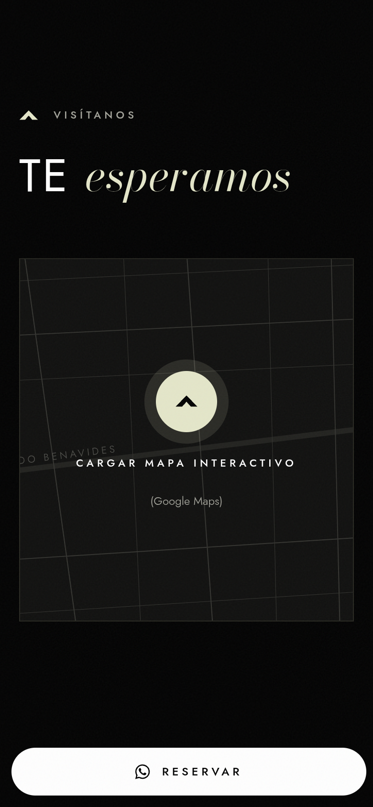 |
| 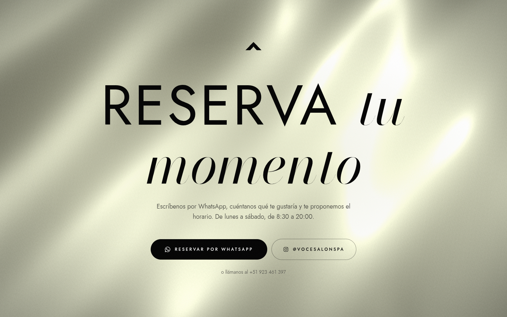 | 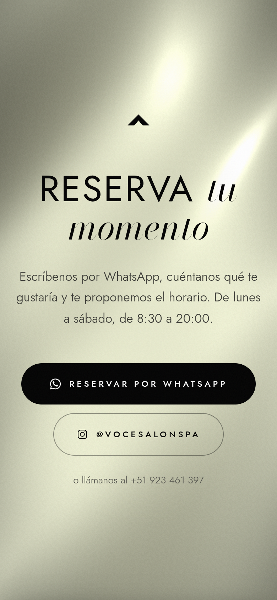 |

Página completa: [escritorio](screenshots/desktop-1440-full.png) · [móvil](screenshots/mobile-390-full.png) · Loader: [escritorio](screenshots/desktop-1440-loader.png) · Movimiento reducido: [hero](screenshots/reduced-motion-1440-hero.png)

---
Demo conceptual no oficial · INKRAAD · octubre 2026.
